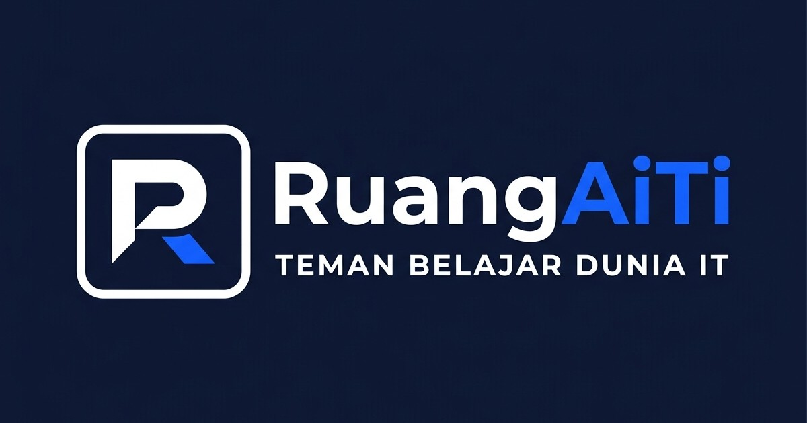

# <p align="center"></p>

# <p align="center">RuangAiTi — Interactive Learning & Technology Blog Platform</p>

<p align="center">
  
  
  
  
  
</p>

---

**RuangAiTi** is a premium, high-performance technology blog and interactive learning platform built with Laravel 10. It integrates robust publishing tools, custom page design modules, learning pathways (Roadmaps), and privacy-first web analytics.

## 🚀 Key Modules & Features

### 📝 1. Core Blog Engine (V1)
*   **Structured Content:** Dynamic publishing of articles, multi-level categories, and tag filtering.
*   **Rich Text Editor:** Fully modified **Summernote WYSIWYG editor** supporting clean HTML rendering, table formatting, and code block formatting.
*   **Author Management:** Profiles, roles (Admin, Author, Visitor), custom taglines, and social links.
*   **Interactive Comments:** Threaded comment and reply system (with guest moderation rules).

### 🛣️ 2. Peta Belajar / Interactive Roadmaps (V2)
*   **Visual Learning Pathways:** Beautiful vertical timeline pathways showing how to master specific tech skills.
*   **Prerequisites & Outcomes:** Map difficulty levels (*Beginner, Intermediate, Advanced*), required prerequisites, and expected outcomes.
*   **Reading Progress:** Dynamic read-time calculation accumulated automatically from the roadmap's articles.

### 📄 3. Pages & Drag-and-Drop Page Builder (V3)
*   **Modular Page Sections:** Construct custom pages using pre-built sections (Hero banners, Features grids, Testimonials, CTA blocks).
*   **Smart Template Rendering:**
    *   *Default Template:* Normal header/footer and title banner layout.
    *   *Landing Page Template:* Hides the default heading banner for a cleaner custom canvas.
    *   *Blank Canvas Template:* Completely hides headers, footers, mobile drawers, and search bars—perfect for custom conversion landers.
*   **Auto-Seeding Layouts:** Creating a page with a template automatically pre-seeds high-quality layout blocks.
*   **Page Revision History:** Keep revisions of your page builds to easily roll back edits.

### 📈 4. Internal Analytics & User Feedback (V3)
*   **Privacy-Friendly Tracking:** Built-in lightweight tracker for unique visitors, page views, devices, and referral URLs—bypassing cookies and database clutter.
*   **Log Purge Controls:** Clean/reset log database tables safely from the admin dashboard (all logs, per day, or custom intervals).
*   **Zero-Result Search Tracking:** Logs keywords that yielded empty results, allowing you to identify what topics your readers are searching for.
*   **Post Feedback:** Interactive rating buttons (Helpful/Unhelpful feedback log) on articles.

### 📂 5. Media Library (V3)
*   **Alt Text Integration:** Direct input of image alternative descriptions inside the library to maximize **Google Image SEO**.

---

## 📈 100/100 SEO & Meta Optimization

*   **Breadcrumb & Article JSON-LD Schema:** Built-in automatic JSON-LD semantic data (`WebSite`, `BlogPosting`, `BreadcrumbList`, and `EducationalOccupationalProgram`) for Google Rich Snippets.
*   **Multi-Sitemap index:** Real-time generation of split sitemaps:
    - `/sitemap.xml` (Main Index)
    - `/sitemap-posts.xml`
    - `/sitemap-pages.xml`
    - `/sitemap-roadmaps.xml`
    - `/sitemap-taxonomies.xml`
    - `/sitemap-authors.xml`
*   **Kanonikal & Alt Tags:** Automatically injects `<link rel="canonical">` to prevent duplicate indexing issues.

---

## 🛠️ Installation & Setup

1.  **Clone the Repository:**
    ```bash
    git clone https://github.com/Ramdhanisheva/ruangaiti.git
    cd ruangaiti
    ```

2.  **Install Dependencies:**
    ```bash
    composer install
    npm install
    ```

3.  **Setup Environment File:**
    Copy `.env.example` to `.env` and configure your database settings.
    ```bash
    cp .env.example .env
    php artisan key:generate
    ```

4.  **Database Migration & Seeding:**
    Run migrations to build all V1-V3 database schemas:
    ```bash
    php artisan migrate
    php artisan db:seed
    ```

5.  **Serve Locally:**
    ```bash
    php artisan serve
    ```

---

## 🔒 Security Configuration

*   Ensure your `.env` is **never** committed or exposed.
*   Debug controllers and file viewing tools (`deploy-v3.php`, `read_env.php`, etc.) must be deleted from the server once deployment is completed on live cPanel/hosting.

---

## 📝 License & Attribution
RuangAiTi is developed and maintained by **[Ramdhanisheva](https://github.com/Ramdhanisheva)**.
